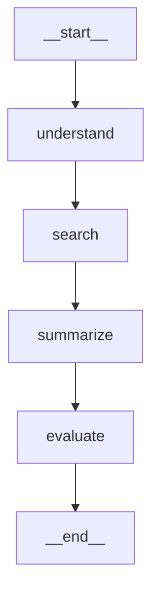

# Module 3 — Getting Started with LangGraph: Building Your First AI Workflow Graph

> **Sub-topic covered:** What are Agents? (10m)
> **Status:** first code in the course. The running project is named and scaffolded here.

---

## Where we left off

Module 1 gave you the organizing idea: **control flow is "who decides what runs next"**, and an agent is a
system where the *LLM* makes that decision. Module 2 opened the engine: a graph is a state machine, you write
only in the Graph Definition layer (`StateGraph`), Pregel executes it in super-steps, and state lives in
channels merged by reducers.

That was all whiteboard. This module is the turn to the keyboard.

Two things happen here:

1. We nail down what "agent" means as an **architecture** — six named parts, and where each part physically
   lives in a LangGraph program. This is the map you'll use for the rest of the course.
2. We build and run the first graph, and start the project we'll grow for the next three modules.

You already know what a node, an edge, and state *are* (Module 2b). We won't re-explain them. We'll write them.

---

## Part 1 — What an agent actually is

You've met this idea twice. Here it is in its most compact form, and then we move on:

```
Agent = LLM + Tools + Reasoning Loop + State
```

Four terms, and every one of them is load-bearing. Drop any one and you don't have an agent:

| Term | What it does | Drop it and you get… |
|---|---|---|
| **LLM** | Interprets intent, plans, decides | A hard-coded script |
| **Tools** | Reaches the outside world — APIs, DBs, search | A chatbot that can only talk |
| **Reasoning loop** | Runs again after seeing results | A one-shot answer |
| **State** | Carries what happened so far | Amnesia — every step starts from zero |

### The loop is the whole point

A plain LLM call has one exit condition: **the text ran out.** The model generated its last token, so it stopped.
Whether the task is actually finished has nothing to do with it.

An agent has a different exit condition: **the goal was met.** It keeps going until it decides it's done.

That single difference is what buys you multi-step reasoning, error recovery, tool calls, long-running work, and
autonomous decisions. Not four separate features — one feature, viewed from four angles.

The loop has four beats:

```
Reason   → interpret the request, plan the next action
Act      → call a tool
Observe  → read what came back
Loop     → re-plan with that new information, or stop
```

### The example that makes it obvious

> *"Book me the cheapest flight to Dubai next Friday, and notify me on WhatsApp."*

An LLM alone produces a sentence about flights. It cannot do this. An agent can, because it can:

1. Search flights
2. Compare prices
3. Select an option
4. Call the booking API
5. Trigger a notification
6. Confirm completion

Notice steps 2 and 3. **Compare** and **select** are decisions made *after* seeing data that didn't exist when
the request arrived. You could not have written that branch in advance — you didn't know what flights existed.
That's `perceive → act → observe → decide`, and it's the hallmark of an agent.

### Six characteristics, honestly

The source lists six properties of an agent. Four of them are really the four terms of the equation again, so
here they are with the duplication removed and the *cost* of each stated:

| Characteristic | What it means | What it costs you |
|---|---|---|
| **Autonomy** | Decides its own next step from context and goals | Unpredictability — you can't enumerate paths in advance |
| **Reasoning** | LLM interprets, plans, generates | Latency and token spend per decision |
| **Tool use** | Invokes search APIs, calculators, databases | Real side effects — a bug now books a real flight |
| **Memory** | Keeps short-term and long-term context | Storage, and context-window pressure |
| **Modularity** | Interchangeable LLMs, tools, memory, prompts | An interface to design and maintain |
| **Adaptability** | Changes behaviour on feedback or state changes | Behaviour that drifts between runs |

Read the right-hand column carefully. That column is the entire reason LangGraph exists. Every mechanism in
this course — checkpoints, interrupts, conditional edges, reducers — is a way to keep a benefit from the middle
column without paying full price on the right.

---

## Part 2 — The anatomy of an agent, and where each part lives

This is the genuinely new material in the module, and it's the map for everything ahead.

An agent is conventionally drawn as six components orbiting a core:

```
                    ┌──────────────────┐
                    │ Prompt Template  │
                    └──────────────────┘
        ┌──────────────────┐    ┌──────────────────┐
        │ Hooks &          │    │ Memory Module    │
        │ Transitions      │    └──────────────────┘
        └──────────────────┘
                    ┌══════════════════┐
                    ║    LLM Core      ║
                    └══════════════════┘
        ┌──────────────────┐    ┌──────────────────┐
        │      State       │    │     Toolset      │
        └──────────────────┘    └──────────────────┘
```

That diagram is fine as a picture, but as a developer you want the mapping: *which line of my code is each of
these?* Here it is.

| Anatomy part | What it is | Where it lives in LangGraph | Already known from |
|---|---|---|---|
| **LLM Core** | The reasoning engine (Claude, GPT, a HF endpoint) | Inside a node body. LangGraph never calls a model itself | LangChain course |
| **Prompt Template** | Role, behaviour, constraints | Inside a node body — `ChatPromptTemplate`, an LCEL chain | LangChain course |
| **Memory Module** | Conversation history, retrieved knowledge | A **state channel** (short-term) + a **checkpointer** or **store** (long-term) | Module 2b |
| **Toolset** | External functions the agent can call | Nodes that run tools — a `@tool` function wrapped in a node, or a prebuilt `ToolNode` | `@tool` from LangChain; Module 4 |
| **State** | Structured object tracking current context | The `TypedDict` schema you pass to `StateGraph(...)` | Module 2b |
| **Hooks & Transitions** | Pre/post-processing and flow control | **Edges** and **conditional edges**; hooks are a Module 4 topic | Module 2b |

Three things worth pausing on:

**The top two rows are LangChain, not LangGraph.** Exactly as Module 2a said: *LangChain is what happens inside
a node, LangGraph is which node runs next.* The anatomy diagram is half a LangChain diagram — and you already
own that half.

**"Memory Module" is one word covering two different things.** A state channel is memory *within* a run. A
checkpointer is memory *across* runs. Module 2b flagged conflating them as a common design mistake; the anatomy
diagram is exactly where that conflation starts.

**"Hooks & Transitions" is the row that is purely LangGraph.** It's the one part of the anatomy that has no
LangChain equivalent, and it's the one that gets its own module (Module 4). That's not a coincidence — it's the
part everyone else hides and LangGraph exposes.

---

## Part 3 — Why agents need a graph

The source makes four claims about why LangGraph suits agents. Each is really "agents need X, LangGraph gives
you X" — so here they are as a single mapping, with the Module 2 concept each one points back to:

| Agents need… | …because | LangGraph gives you | Covered in |
|---|---|---|---|
| **Control flow** | The loop needs branches, retries, and an exit | Cyclic graphs, conditional edges, multi-agent handoff | 2b — conditional edges |
| **Memory** | Step 5 must see what step 2 found | Stateful nodes: intermediate results, history, tool outputs, error traces | 2b — channels + reducers |
| **Modularity** | `planner`, `retriever`, `executor`, `evaluator` are separate concerns | Each behaviour is a reusable node; nodes swap without touching their neighbours | 2b — reason 4 |
| **Safe execution** | Long runs crash halfway, and a half-booked flight is worse than none | Checkpointing — resume from the last completed super-step | 2b — reason 3 |

Nothing new here, which is the point: you've already got the concepts. The value of this table is that it names
the **four node roles** you'll see over and over — planner, retriever, executor, evaluator — and those four
names are the skeleton of almost every agent graph you will ever draw.

---

## Part 4 — The worked example, and our project

The course's example is a **Research Assistant Agent**:

> **Goal:** *"Explain LangGraph architecture using 3 reliable sources."*

Its steps:

```
1. Understand query
2. Search documentation
3. Extract key points
4. Build structured explanation
5. Verify clarity
6. Return final answer
```

drawn as:

```
User Query
    ↓
Planner Agent   (decides actions)
    ↓
Search Tool     (docs, website)
    ↓
Summarizer      (extracts key points)
    ↓
Evaluator       (checks final quality)
    ↓
Result
```

### Read that diagram again

Every arrow points down. Nothing points back. **That is a chain, not an agent.**

If the Evaluator decides the answer is thin — only found 1 source instead of 3 — the diagram has nowhere for it
to go. It hands a bad answer to Result and shrugs. The one thing that makes something an agent, the loop, is
missing from the picture.

This isn't a nitpick, it's the exact gap this course exists to close. Module 2b ended on it: **a chain is a
degenerate graph — add one backward edge and you get the whole paradigm shift.** So here's the version we're
actually building toward:

```
        START
          ↓
      understand
          ↓
       search ←──────────────┐
          ↓                  │
      summarize              │  "not enough sources — search again"
          ↓                  │
       evaluate ─────────────┘
          ↓ (good enough)
         END
```

One extra arrow. That arrow is the difference between the two paradigms, and it's why the whole thing had to be
a graph.

We'll build the straight-line version **now**, because you should see the mechanics work before you add
branching. The backward edge and the router that decides it arrive in Module 5, where conditional edges are the
topic. Everything we write today survives that change unmodified — you'll add one `add_conditional_edges` call
and delete one `add_edge`.

### The project

> ## 🔬 Running project: **Research Assistant** (`research_assistant/`)
>
> A graph that answers a question from a document corpus and refuses to be satisfied with weak sourcing.
>
> | Version | Lands in | Adds |
> |---|---|---|
> | **v0.1** | Module 3 (here) | Linear 4-node graph, typed state, one real LLM call |
> | v0.2 | Module 4 | Prebuilt agent + hooks, the same job done the black-box way |
> | v0.3+ | Module 5 | The backward edge, persistence, time travel, interrupts, memory |
> | v0.4+ | Module 6 | Subgraphs and streaming |

Why this project and not something else: it is the smallest thing that genuinely *needs* every mechanism in the
syllabus. It needs a loop (re-search on weak results), a tool (search), state (accumulating sources), a
checkpoint (searches are slow, don't redo them), and an interrupt (let a human approve before citing). One
project, every topic, no contrivance.

---

## Part 5 — Hands on: the smallest graph that runs

### Setup

```bash
cd "start learning"
python -m venv .venv
.venv\Scripts\activate          # Windows
# source .venv/bin/activate     # macOS / Linux

pip install langgraph langchain-huggingface python-dotenv
```

Then copy the token template:

```bash
cp .env.example .env            # then paste your HF token into .env
```

`.env` is gitignored in this repo. `.env.example` is the tracked template.

### Five lines, then it runs

Before the project, build the absolute minimum — no LLM, no tools, just the machinery — so that when something
breaks later you know it isn't the graph.

```python
from typing import TypedDict
from langgraph.graph import StateGraph, START, END


# 1. The state schema. This is the contract every node reads from and writes to.
class CounterState(TypedDict):
    value: int
    log: str


# 2. A node is a plain function: state in, PARTIAL update out.
def double(state: CounterState) -> dict:
    return {"value": state["value"] * 2}


def describe(state: CounterState) -> dict:
    return {"log": f"final value is {state['value']}"}


# 3. Declare the structure.
builder = StateGraph(CounterState)
builder.add_node("double", double)
builder.add_node("describe", describe)

builder.add_edge(START, "double")
builder.add_edge("double", "describe")
builder.add_edge("describe", END)

# 4. Compile — this validates the graph and produces something runnable.
graph = builder.compile()

# 5. Run it.
print(graph.invoke({"value": 21, "log": ""}))
# {'value': 42, 'log': 'final value is 42'}
```

Four observations, because each one is a thing people get wrong on their first graph:

**`double` returned `{"value": ...}` and nothing else, but `log` survived.** Nodes return *partial updates*, not
replacement state. LangGraph merges the returned dict into the state at the super-step barrier. Returning the
whole state from every node is the most common beginner habit and it's unnecessary.

**Nodes never call each other.** `double` doesn't know `describe` exists. The edge knows. That's the indirection
Module 2b called out as what makes nodes swappable — and it's why you can insert a node between two others
without editing either.

**`START` and `END` are real nodes.** `add_edge(START, "double")` is what makes `double` the entry point;
there's no implicit "first node declared wins". `END` is what makes termination explicit rather than "we ran out
of things to do".

**`compile()` is a real step, not ceremony.** It validates: unreachable nodes, edges to nodes that don't exist,
no path from `START`. Get an error here and you have a structural bug, not a runtime one. It's also where
checkpointers get attached — `compile(checkpointer=...)` in Module 5.

Compare that to LCEL, which you know well:

```python
chain = double | describe          # structure and wiring fused into one expression
```

```python
builder.add_node("double", double)         # what can run
builder.add_edge("double", "describe")     # what runs after what
```

LCEL fuses "what runs" with "what runs next". LangGraph separates them into two statements. That separation
looks like extra typing for a straight line — and it *is*, for a straight line. It's what lets a node have two
incoming edges, or an edge that points backwards. You're paying two lines now to buy cycles later.

---

## Part 6 — Project v0.1: the Research Assistant

### The story before the code

Imagine you're building an **internal research tool** for a company. An employee types a question:

> *"Explain LangGraph architecture using 3 reliable sources."*

Your job: build a system that automatically researches and answers it — not just guesses from memory.

You hire a small research team. Four people, one job each:

```
Employee types question
        ↓
  [ Analyst ]      → reads the question, strips filler, extracts search keywords
        ↓
  [ Librarian ]    → goes to the document shelf, finds the best matching docs
        ↓
  [ Writer ]       → reads the docs, writes a cited answer using an LLM
        ↓
  [ Editor ]       → checks: "did we cite enough sources? is this good enough?"
        ↓
Employee gets answer
```

That's the graph. Four nodes, four people, one job each. Now open the files — each one maps to exactly one part of this picture.

---

Now the real thing. Four files, each small.

### `state.py` — the shared whiteboard

Before anyone starts working, you set up a **shared whiteboard** in the office. Every team member reads from it and writes to it. At the start, only the employee's question is on it. As each person finishes their job, they fill in their section. The next person reads what was written before them.

```python
import operator
from typing import Annotated, TypedDict


class Source(TypedDict):
    title: str
    text: str


class ResearchState(TypedDict):
    question: str                                    # what the user asked
    keywords: list[str]                              # what `understand` decided to look for
    sources: Annotated[list[Source], operator.add]   # ACCUMULATES across searches
    summary: str                                     # the drafted answer
    verdict: str                                     # evaluator's judgement
```

The one line that matters: `Annotated[list[Source], operator.add]`.

Every other field uses the default reducer — **overwrite**. A second write replaces the first. That's correct
for `summary`; a redraft should replace the old draft.

`sources` is different. Once we add the backward edge, `search` runs more than once, and the second search must
*add to* what the first found, not erase it. Without that reducer, looping would silently throw away results —
which is precisely the "the agent lost its memory" bug Module 2b warned about. We're writing the reducer now,
one module before we need it, because retrofitting it means debugging a loop that mysteriously never
accumulates.

### `corpus.py` — the document shelf (filing cabinet)

This is the Librarian's filing cabinet — a fake one with 4 documents inside, each tagged by topic. The Librarian's job is to look at the keywords on the whiteboard and return the documents with the most matching tags.

Not the point of the lesson, but we need something to search. Module 5 swaps this for a real retriever.

```python
CORPUS = [
    {
        "title": "LangGraph Docs — Core Concepts",
        "text": "LangGraph models an application as a graph. Nodes do work, edges decide "
                "what runs next, and a shared state object is threaded through both.",
        "tags": ["langgraph", "architecture", "graph", "nodes", "edges", "state"],
    },
    {
        "title": "Pregel and Super-Steps",
        "text": "Execution follows the Pregel model. Each super-step plans which nodes are "
                "active, runs them in parallel, then merges their writes at a barrier.",
        "tags": ["langgraph", "architecture", "pregel", "execution", "parallel"],
    },
    {
        "title": "Channels and Reducers",
        "text": "State keys are channels. A reducer defines how a new write merges with the "
                "existing value. The default reducer overwrites; add_messages appends.",
        "tags": ["langgraph", "state", "channels", "reducers", "architecture"],
    },
    {
        "title": "Checkpointing Guide",
        "text": "A checkpointer persists state after every super-step, which is what enables "
                "resume-after-crash, replay, and human-in-the-loop pauses.",
        "tags": ["langgraph", "checkpointing", "persistence", "reliability"],
    },
]


def search_corpus(keywords: list[str], limit: int = 3) -> list[dict]:
    """Score every document by keyword overlap, return the best `limit` matches."""
    scored = []
    for doc in CORPUS:
        hits = len(set(keywords) & set(doc["tags"]))
        if hits:
            scored.append((hits, doc))

    scored.sort(key=lambda pair: pair[0], reverse=True)
    return [{"title": doc["title"], "text": doc["text"]} for _, doc in scored[:limit]]
```

### `nodes.py` — the four team members

This file defines what each person on the team actually does. Four functions, one per role.

Remember the four names from Part 3: planner, retriever, executor, evaluator. Here they are as
`understand` / `search` / `summarize` / `evaluate`.

```python
import os

from dotenv import load_dotenv
from huggingface_hub import InferenceClient

from .corpus import search_corpus
from .state import ResearchState

load_dotenv()

MIN_SOURCES = 3
MODEL = "meta-llama/Llama-3.1-8B-Instruct"

_client = None


def get_client() -> InferenceClient:
    """Built once, lazily — so importing this module doesn't need a token."""
    global _client
    if _client is None:
        _client = InferenceClient(
            provider="novita",
            api_key=os.environ["HUGGINGFACEHUB_API_TOKEN"],
        )
    return _client


STOPWORDS = {
    "explain", "using", "what", "how", "why", "the", "a", "an", "and", "or",
    "with", "for", "of", "in", "to", "is", "are", "reliable", "sources", "me",
}

SYSTEM_PROMPT = (
    "You are a research assistant. Answer ONLY from the sources provided. "
    "Cite each source by its title in square brackets. If the sources do not "
    "cover the question, say so plainly."
)


# ── planner ──────────────────────────────────────────────────────────────
# THE ANALYST: reads the question, strips filler words, writes keywords to the whiteboard.
# No LLM. Pure string processing — fast and cheap.
def understand(state: ResearchState) -> dict:
    words = (w.strip("?.,\"'").lower() for w in state["question"].split())
    keywords = [w for w in words if w and w not in STOPWORDS and len(w) > 2]
    return {"keywords": keywords}


# ── retriever ────────────────────────────────────────────────────────────
# THE LIBRARIAN: reads keywords from the whiteboard, searches the filing cabinet,
# writes the best matching documents to `sources`.
def search(state: ResearchState) -> dict:
    found = search_corpus(state["keywords"])
    # `sources` has an `operator.add` reducer, so this APPENDS.
    return {"sources": found}


# ── executor ─────────────────────────────────────────────────────────────
# THE WRITER: reads the question and sources, calls the LLM, writes a cited answer.
# Uses InferenceClient directly (provider="novita") — HuggingFace's new router
# requires an explicit provider; "novita" hosts this model on the free tier.
def summarize(state: ResearchState) -> dict:
    sources_text = "\n\n".join(
        f"[{s['title']}] {s['text']}" for s in state["sources"]
    ) or "(no sources found)"

    response = get_client().chat_completion(
        model=MODEL,
        messages=[
            {"role": "system", "content": SYSTEM_PROMPT},
            {"role": "user", "content": f"Question: {state['question']}\n\nSources:\n{sources_text}"},
        ],
        max_tokens=512,
        temperature=0.3,
    )
    summary = response.choices[0].message.content
    return {"summary": summary}


# ── evaluator ────────────────────────────────────────────────────────────
# THE EDITOR: counts the sources. Writes a verdict — "ok" or "weak".
# Right now nobody acts on the verdict. In Module 5, a "weak" verdict will send
# the Librarian back to search again. That one backward edge turns this into an agent.
def evaluate(state: ResearchState) -> dict:
    count = len(state["sources"])
    if count >= MIN_SOURCES:
        return {"verdict": f"ok — {count} sources"}
    return {"verdict": f"weak — only {count} source(s), wanted {MIN_SOURCES}"}
```

Look at `summarize`. The LLM call is a plain `chat_completion` using `huggingface_hub.InferenceClient` directly.
The course originally showed this as an LCEL chain (`SUMMARIZE_PROMPT | get_llm() | StrOutputParser()`), and
conceptually the logic is identical — format a prompt, call a model, extract the text. We use `InferenceClient`
directly here because HuggingFace's newer router requires an explicit `provider`, and `langchain-huggingface`'s
`HuggingFaceEndpoint` doesn't support that yet. The LangGraph structure — node receives state, returns partial
update — is unchanged. **That's the design working**: what happens *inside* a node (how you call the model)
is completely decoupled from the graph. Swap the LLM call however you like; the graph doesn't notice.

And look at `evaluate`. It computes a verdict and… stores it. Nobody acts on it. That's the missing backward
edge, sitting there as a string, waiting for Module 5 to turn it into a routing decision.

### `graph.py` — the office layout (who works after whom)

`nodes.py` defined *what each person does*. This file answers a completely separate question: *in what order do they work?*

Notice: this file has no idea what `understand` or `search` actually do. It only says Analyst → Librarian → Writer → Editor → done. That separation is the whole point — you could swap the Librarian for one that hits a real search API tomorrow, and this file doesn't change at all.

```python
from langgraph.graph import END, START, StateGraph

from .nodes import evaluate, search, summarize, understand
from .state import ResearchState


def build_graph():
    builder = StateGraph(ResearchState)

    # What can run.
    builder.add_node("understand", understand)
    builder.add_node("search", search)
    builder.add_node("summarize", summarize)
    builder.add_node("evaluate", evaluate)

    # What runs after what. (v0.2 replaces the last edge with a conditional one.)
    builder.add_edge(START, "understand")
    builder.add_edge("understand", "search")
    builder.add_edge("search", "summarize")
    builder.add_edge("summarize", "evaluate")
    builder.add_edge("evaluate", END)

    return builder.compile()
```

Twelve lines, and the entire control flow of the application is visible in them. That's Module 2b's reason 2 —
*control flow becomes visible* — cashed in. Compare it to reading a `while` loop with three `break`s to work out
when an agent stops.

### `main.py` — the employee submits a question

This is the entry point. You hand the question to the first team member. The graph runs all four nodes in sequence. You get back the completed whiteboard — keywords, sources, summary, verdict — all filled in.

```python
from research_assistant.graph import build_graph

QUESTION = "Explain LangGraph architecture using 3 reliable sources."


def main():
    graph = build_graph()

    # The structure, as text. No extra dependencies needed.
    print(graph.get_graph().draw_mermaid())

    final = graph.invoke({
        "question": QUESTION,
        "sources": [],          # reducer channels: seed them explicitly
    })

    print("\nKEYWORDS:", final["keywords"])
    print("\nSOURCES:")
    for s in final["sources"]:
        print("  -", s["title"])
    print("\nSUMMARY:\n", final["summary"])
    print("\nVERDICT:", final["verdict"])


if __name__ == "__main__":
    main()
```

```bash
python -m research_assistant.main
```

Two details in that `invoke` call worth knowing before they bite you:

**You don't have to supply every key.** `TypedDict` describes the shape; it isn't enforced at runtime. Keys no
node has written yet simply don't exist in the state dict. So a node reading a key that an earlier node might
have skipped should use `state.get("key", default)`, not `state["key"]`.

**Seed reducer channels explicitly.** `"sources": []` is there deliberately. Channels with a reducer behave
better when they start from a known empty value, and being explicit costs nothing.

### The one-line summary

> **Each file has exactly one job:** `state.py` = the shared whiteboard · `corpus.py` = the filing cabinet · `nodes.py` = the 4 team members · `graph.py` = the order they work in · `main.py` = the employee who submits the question.

That separation — *what each person does* vs *the order they work in* — is the entire design principle of LangGraph. In a normal Python script, both would be tangled together in one big function. Here they're two separate files, and that's what lets you add a backward edge in Module 5 without rewriting anything.

---

## Part 7 — Seeing the graph

`compile()` gives you an object that can describe its own structure:

```python
print(graph.get_graph().draw_mermaid())
```



Paste that into any Mermaid renderer (GitHub markdown renders it natively) and you have a live architecture
diagram that **cannot drift from the code**, because it *is* the code. For a PNG:

```python
png = graph.get_graph().draw_mermaid_png()   # needs network access or a local renderer
open("graph.png", "wb").write(png)
```

Module 2b used `networkx` purely as a drawing aid to make a point. This is the real tool, and it needs no extra
library for the text form.

Right now the diagram is a straight line, and that's the honest picture — v0.1 *is* a chain. Come back to this
command after Module 5 and you'll see the arrow that goes back up.

---

## Part 8 — Where this shows up in real systems

The five use cases from the course, with the graph shape each one actually takes:

| Use case | What the agent does | Graph shape |
|---|---|---|
| **Customer support automation** | Triage tickets, answer FAQs, escalate hard ones | Router node → domain sub-agents (this is Anita & Karthik's bot from 2b) |
| **Enterprise knowledge retrieval** | Retrieve, summarize, contextualize internal docs | RAG pipeline + a quality loop — *our project* |
| **Research assistance** | Summarize papers, generate citations, suggest related work | Multi-agent: summarizer + evaluator + optimizer |
| **Workflow automation** | Orchestrate across APIs, databases, internal tools | Orchestrator delegating to worker nodes by input type |
| **Education & tutoring** | Personalized paths, answer questions, track progress | Long-term memory + feedback loop |

Read the right-hand column, not the left. Five different business domains, and there are only about four graph
shapes underneath: **route**, **loop**, **delegate**, **remember**. Learn the shapes and the domains stop
mattering — which is exactly why this course teaches the graph rather than a catalogue of agents.

---

## Common first-graph mistakes

| Symptom | Cause | Fix |
|---|---|---|
| `KeyError` inside a node | Reading a key no node has written yet | `state.get("key", default)` |
| State keeps resetting | Returning full state instead of a partial update, or a missing reducer | Return only what changed; add `Annotated[..., operator.add]` |
| Graph never terminates | No edge to `END` | Every terminal path needs `add_edge(node, END)` |
| Compile error: node unreachable | Forgot `add_edge(START, ...)` | Entry point is an explicit edge, not the first node declared |
| Two parallel nodes write one key and it raises | Unreduced concurrent writes | Add a reducer — this is by design, not a bug (2b) |
| Node name typo passes silently at `add_node`, fails at `add_edge` | Edges reference nodes by string name | Trust the `compile()` error; it names the missing node |

---

## Self-check

You should be able to answer these without scrolling up:

1. What are the four terms in `Agent = LLM + Tools + Reasoning Loop + State`, and what breaks if you remove each?
2. What is the exit condition of a plain LLM call, versus the exit condition of an agent?
3. Name the six anatomy parts. Which two are LangChain's job? Which one is purely LangGraph's?
4. Why isn't the Research Assistant flow diagram (User Query → Planner → Search → Summarizer → Evaluator →
   Result) actually an agent?
5. A node returns `{"summary": "..."}`. What happens to the other keys in the state?
6. Why does `sources` need `Annotated[list, operator.add]` but `summary` doesn't?
7. What does `compile()` actually do, and name two errors it catches?
8. In LCEL, `a | b` says two things at once. What are they, and which two LangGraph calls split them apart?
9. Which single line would you change to make `evaluate` send weak results back to `search`?

---

## Full project source — v0.1

```
start learning/
├── .env                      # gitignored — your HF token
├── .env.example
└── research_assistant/
    ├── __init__.py
    ├── state.py              # ResearchState — the contract
    ├── corpus.py             # stand-in search tool
    ├── nodes.py              # understand / search / summarize / evaluate
    ├── graph.py              # StateGraph wiring
    └── main.py               # entry point
```

**`research_assistant/__init__.py`**

```python
"""Research Assistant — the running project for the LangGraph course."""
```

**`research_assistant/state.py`**

```python
import operator
from typing import Annotated, TypedDict


class Source(TypedDict):
    title: str
    text: str


class ResearchState(TypedDict):
    question: str
    keywords: list[str]
    sources: Annotated[list[Source], operator.add]
    summary: str
    verdict: str
```

**`research_assistant/corpus.py`**

```python
CORPUS = [
    {
        "title": "LangGraph Docs — Core Concepts",
        "text": "LangGraph models an application as a graph. Nodes do work, edges decide "
                "what runs next, and a shared state object is threaded through both.",
        "tags": ["langgraph", "architecture", "graph", "nodes", "edges", "state"],
    },
    {
        "title": "Pregel and Super-Steps",
        "text": "Execution follows the Pregel model. Each super-step plans which nodes are "
                "active, runs them in parallel, then merges their writes at a barrier.",
        "tags": ["langgraph", "architecture", "pregel", "execution", "parallel"],
    },
    {
        "title": "Channels and Reducers",
        "text": "State keys are channels. A reducer defines how a new write merges with the "
                "existing value. The default reducer overwrites; add_messages appends.",
        "tags": ["langgraph", "state", "channels", "reducers", "architecture"],
    },
    {
        "title": "Checkpointing Guide",
        "text": "A checkpointer persists state after every super-step, which is what enables "
                "resume-after-crash, replay, and human-in-the-loop pauses.",
        "tags": ["langgraph", "checkpointing", "persistence", "reliability"],
    },
]


def search_corpus(keywords: list[str], limit: int = 3) -> list[dict]:
    """Score every document by keyword overlap, return the best `limit` matches."""
    scored = []
    for doc in CORPUS:
        hits = len(set(keywords) & set(doc["tags"]))
        if hits:
            scored.append((hits, doc))

    scored.sort(key=lambda pair: pair[0], reverse=True)
    return [{"title": doc["title"], "text": doc["text"]} for _, doc in scored[:limit]]
```

**`research_assistant/nodes.py`**

```python
import os

from dotenv import load_dotenv
from huggingface_hub import InferenceClient

from .corpus import search_corpus
from .state import ResearchState

load_dotenv()

MIN_SOURCES = 3
MODEL = "meta-llama/Llama-3.1-8B-Instruct"

_client = None


def get_client() -> InferenceClient:
    """Built once, lazily — so importing this module doesn't need a token."""
    global _client
    if _client is None:
        _client = InferenceClient(
            provider="novita",
            api_key=os.environ["HUGGINGFACEHUB_API_TOKEN"],
        )
    return _client


STOPWORDS = {
    "explain", "using", "what", "how", "why", "the", "a", "an", "and", "or",
    "with", "for", "of", "in", "to", "is", "are", "reliable", "sources", "me",
}

SYSTEM_PROMPT = (
    "You are a research assistant. Answer ONLY from the sources provided. "
    "Cite each source by its title in square brackets. If the sources do not "
    "cover the question, say so plainly."
)


# ── planner ──────────────────────────────────────────────────────────────
def understand(state: ResearchState) -> dict:
    words = (w.strip("?.,\"'").lower() for w in state["question"].split())
    keywords = [w for w in words if w and w not in STOPWORDS and len(w) > 2]
    return {"keywords": keywords}


# ── retriever ────────────────────────────────────────────────────────────
def search(state: ResearchState) -> dict:
    found = search_corpus(state["keywords"])
    # `sources` has an `operator.add` reducer, so this APPENDS.
    return {"sources": found}


# ── executor ─────────────────────────────────────────────────────────────
def summarize(state: ResearchState) -> dict:
    sources_text = "\n\n".join(
        f"[{s['title']}] {s['text']}" for s in state["sources"]
    ) or "(no sources found)"

    response = get_client().chat_completion(
        model=MODEL,
        messages=[
            {"role": "system", "content": SYSTEM_PROMPT},
            {"role": "user", "content": f"Question: {state['question']}\n\nSources:\n{sources_text}"},
        ],
        max_tokens=512,
        temperature=0.3,
    )
    summary = response.choices[0].message.content
    return {"summary": summary}


# ── evaluator ────────────────────────────────────────────────────────────
def evaluate(state: ResearchState) -> dict:
    count = len(state["sources"])
    if count >= MIN_SOURCES:
        return {"verdict": f"ok — {count} sources"}
    return {"verdict": f"weak — only {count} source(s), wanted {MIN_SOURCES}"}
```

**`research_assistant/graph.py`**

```python
from langgraph.graph import END, START, StateGraph

from .nodes import evaluate, search, summarize, understand
from .state import ResearchState


def build_graph():
    builder = StateGraph(ResearchState)

    # What can run.
    builder.add_node("understand", understand)
    builder.add_node("search", search)
    builder.add_node("summarize", summarize)
    builder.add_node("evaluate", evaluate)

    # What runs after what. (Module 5 replaces the last edge with a conditional one.)
    builder.add_edge(START, "understand")
    builder.add_edge("understand", "search")
    builder.add_edge("search", "summarize")
    builder.add_edge("summarize", "evaluate")
    builder.add_edge("evaluate", END)

    return builder.compile()
```

**`research_assistant/main.py`**

```python
from research_assistant.graph import build_graph

QUESTION = "Explain LangGraph architecture using 3 reliable sources."


def main():
    graph = build_graph()

    # The structure, as text. No extra dependencies needed.
    print(graph.get_graph().draw_mermaid())

    final = graph.invoke({
        "question": QUESTION,
        "sources": [],          # reducer channels: seed them explicitly
    })

    print("\nKEYWORDS:", final["keywords"])
    print("\nSOURCES:")
    for s in final["sources"]:
        print("  -", s["title"])
    print("\nSUMMARY:\n", final["summary"])
    print("\nVERDICT:", final["verdict"])


if __name__ == "__main__":
    main()
```

---

## Next up

**Module 4 — Prebuilt Agents in LangGraph** (1h): Hooks · `langgraph-prebuilt` · `langgraph-supervisor`.

You've now built a graph by hand, so `create_react_agent` — which you used as a black box in the LangChain
course — stops being magic. Module 4 is "here's what was actually running": the same four node roles, wired
into a loop for you. And **hooks** finally fills in the last row of the anatomy table.
