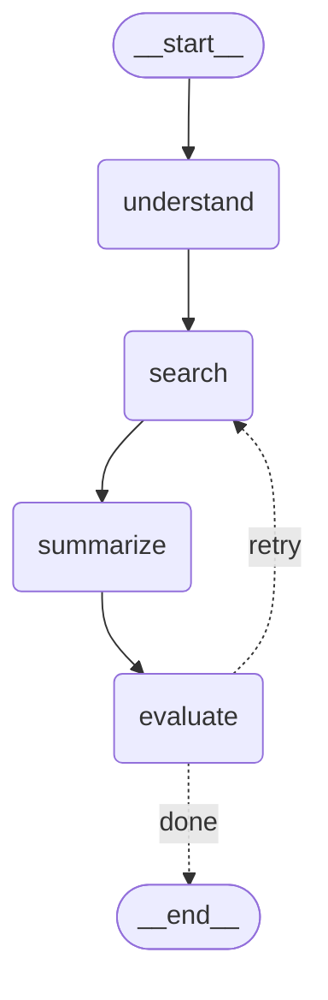

# Module 5.1 — Building the Workflow

## Where we left off

Module 3 built the Research Assistant as four nodes in a straight line:

```
START → understand → search → summarize → evaluate → END
```

The `evaluate` node counted the sources it had and wrote a verdict — `"ok — 3 sources"` or
`"weak — only 1 source(s)"` — into state. And then nothing happened. The graph went to `END`
either way. That verdict was a note nobody read.

Module 4 rebuilt the same job with `create_react_agent`, which does loop, but the loop is
sealed: you get exactly the loop LangChain wrote, and you cannot open it up.

This lesson replaces one line:

```python
builder.add_edge("evaluate", END)          # v0.2 — always ends
```

with this:

```python
builder.add_conditional_edges("evaluate", route_after_evaluate, {...})   # v0.3
```

That is the whole sub-topic. Everything else here is the machinery you need around it so
the change is safe. When you're done, `evaluate` will be able to send work **backwards** to
`search`, and the Research Assistant stops being a pipeline and starts being an agent.

---

## 1. The seven steps

Building any LangGraph workflow is the same seven steps every time:

```
1. Create a StateGraph        ← declare the shape of the data
2. Add nodes                  ← declare the units of work
3. Add an entry point         ← where execution begins
4. Add edges + an exit point  ← what runs after what, and where it stops
5. Compile                    ← validate and freeze into a runnable object
6. Visualize (optional)       ← check that what you built is what you meant
7. Run                        ← invoke() or stream()
```

One thing to be clear about before we start: **this is a build order, not a runtime order.**
Steps 1–5 all run once, at import time, before any user request exists. They construct a
description of a graph. Step 7 is the only thing that happens per request.

That separation is the reason a LangGraph app can be checkpointed, visualised, and replayed:
the structure is a value that exists independently of any particular run.

---

## 2. Step 1 — Define the state

### What the state is

The state is **one dictionary that every node reads from and writes to.**

That's it. There is no message bus, no node-to-node argument passing, no return values
flowing along the edges. A node gets handed the current state and hands back some changes.
The graph merges those changes and hands the result to whoever runs next.

The whiteboard analogy from Module 3 still holds: the nodes are people in a room, the state
is the whiteboard on the wall. Nobody hands anybody a piece of paper. Everyone reads the
board and writes on the board.

For a chatbot the board might hold:

| Slot | Holds |
|---|---|
| the latest user input | what was just asked |
| the conversation history | everything said so far |
| intermediate results | tool outputs, retrieved docs, scores |
| metadata | user profile, timestamps, retry counters |

### Why it's worth being formal about

Three payoffs, and the third is the one that matters for the rest of Module 5:

| | What you get |
|---|---|
| **Centralised context** | Every node reads and writes the same object. There is one place to look when something is wrong. |
| **Modularity** | A node's contract is "I read these keys, I write these keys." Two nodes that respect the schema are swappable without touching each other. |
| **Traceability** | Because state is an explicit value, the runtime can *save* it after every step. That's what makes checkpointing, replay, and time travel possible. |

Traceability is not a nice-to-have here. **Time Travel is a whole sub-topic later in this
module, and it only works because state is a plain serialisable object.** If your nodes
communicated by mutating shared globals or calling each other directly, there would be
nothing to snapshot.

### How to declare it

Three options. LangGraph accepts all of them:

```python
# 1. TypedDict — the default. Plain dict at runtime, typed for your editor.
from typing import TypedDict, Optional

class ChatState(TypedDict):
    input: str
    messages: list[str]
    tool_result: Optional[str]
```

```python
# 2. dataclass — attribute access (state.input instead of state["input"]).
from dataclasses import dataclass, field

@dataclass
class ChatState:
    input: str
    messages: list[str] = field(default_factory=list)
```

```python
# 3. Pydantic BaseModel — actual runtime validation.
from pydantic import BaseModel

class ChatState(BaseModel):
    input: str
    messages: list[str] = []
```

Which to pick:

| Use | When |
|---|---|
| `TypedDict` | Default. Zero overhead, and the state really is a dict, which matches how LangGraph works internally. |
| `dataclass` | You prefer `state.input` over `state["input"]` and want defaults. |
| `BaseModel` | You need input actually validated — untrusted input, or a state schema shared across a team boundary. Costs a validation pass on every node transition. |

Then hand the class to the builder:

```python
from langgraph.graph import StateGraph

graph_builder = StateGraph(ChatState)
```

`graph_builder` is the canvas. Nodes, edges, entry and exit points all get registered on it,
and at the end you `compile()` it.

> **Carried over from Module 3, still true:** a `TypedDict` is **not** enforced at runtime. It
> is a hint for your editor. If no node has written `summary` yet, `state["summary"]` raises
> `KeyError` — the key simply isn't there. Use `state.get("summary", "")` for anything that
> might not have been written yet.

---

## 3. Step 2 — Add nodes

### What a node is

A node is a function. It takes the current state and returns **a dict of the keys it changed.**

```python
def greet_user(state: ChatState) -> dict:
    return {"messages": [f"Hello! You said: {state['input']}"]}

graph_builder.add_node("greet", greet_user)
```

`"greet"` is the name the edges will use. `greet_user` is the function that runs.

### Two things the course's example gets wrong

The source shows this node:

```python
def greet_user(state):
    user_input = state["input"]
    response = f"Hello! You said: {user_input}"
    state["messages"].append(response)      # (1) mutates the state in place
    return {"messages": state["messages"]}  # (2) returns the whole list back
graph_builder.add_node("greet", function=greet_user)   # (3) wrong keyword
```

**(3) is a straight error.** The signature is `add_node(node, action)` — the second argument
is positional. Passing `function=` raises `RuntimeError` in langgraph 1.x. Write
`add_node("greet", greet_user)`.

**(1) and (2) are the real trap**, because they *appear* to work. Here is what actually
happens when `messages` has an appending reducer like `operator.add` or `add_messages`:

```
state["messages"] is        ["a", "b"]
node appends "c" in place → ["a", "b", "c"]        ← the state object is now mutated
node returns               {"messages": ["a","b","c"]}
reducer runs: old + new  → ["a","b","c"] + ["a","b","c"]
                         = ["a","b","c","a","b","c"]     ← duplicated
```

Every message gets duplicated, and the duplication compounds each pass. The fix is the rule
from Module 3, which is worth repeating because this is exactly where it bites:

> **A node returns only what changed. Never mutate the state you were given.**

```python
def greet_user(state: ChatState) -> dict:
    return {"messages": [f"Hello! You said: {state['input']}"]}   # just the new item
```

The reducer does the appending. That's its entire job.

### Other things nodes can be

**Async is fine.** Define `async def`, and drive the graph with `await app.ainvoke(...)` /
`async for step in app.astream(...)`.

**A LangChain Runnable is a node.** This is Module 2a's "LangChain inside a node" made
concrete — an LCEL chain has an `.invoke(input) -> output` interface, which is exactly what
a node needs:

```python
from langchain_core.prompts import ChatPromptTemplate

prompt = ChatPromptTemplate.from_template("Tell me a joke about {topic}")
runnable_node = prompt | model            # a plain LCEL chain

builder.add_node("joke", runnable_node)   # registered directly as a node
```

Be careful with the plumbing: the chain receives the whole state dict as its input, so the
prompt's variables must be state keys. When they aren't, wrap it:

```python
builder.add_node("joke", lambda state: {"joke": (prompt | model).invoke({"topic": state["subject"]}).content})
```

**Keep nodes single-purpose.** Not style advice — a node is the unit of retry, the unit of
checkpointing, and the unit a conditional edge can route around. A node that does four things
is four things you can't retry, resume, or route independently.

---

## 4. Steps 3 and 4 — Entry and exit points

Execution has to start somewhere and stop somewhere. There are two spellings.

**The sugar:**

```python
graph_builder.set_entry_point("greet")     # start here
graph_builder.set_finish_point("greet")    # stop after this
```

**What it means:**

```python
from langgraph.graph import START, END

graph_builder.add_edge(START, "greet")
graph_builder.add_edge("greet", END)
```

Both work. Prefer the second: `START` and `END` are real sentinel nodes, so once you know
that, entry and exit stop being two special concepts and become ordinary edges. Current
LangChain documentation and examples use `START` / `END` throughout.

### Correcting the course here

The source says an exit point needs an end node, and shows this:

```python
def end_conversation(state):
    return {}
builder.add_node("end", end_conversation)
builder.add_edge("greet", "end")
Graph_builder.set_finish_point("end")
```

**You don't need that.** `END` already exists. A node that returns `{}` and then terminates
is a node that does nothing, and it costs you a super-step and a checkpoint write for the
privilege. Just do:

```python
builder.add_edge("greet", END)
```

Write a real final node only when it has real work to do — emit a metric, close a session,
format the response. "Because the graph needs somewhere to end" is not real work.

### Two notes from the source, made precise

> *"You can only have one entry point."*

True of the `set_entry_point` helper — calling it twice replaces the first. But `START` is a
node like any other, and it can fan out:

```python
builder.add_edge(START, "fetch_user")
builder.add_edge(START, "fetch_orders")     # both run, in parallel, in super-step 1
```

That's the Pregel model from Module 2b: both nodes activate in the same super-step, run
concurrently, and their writes merge at the barrier. Perfectly legal, and often what you want.

> *"You can have multiple exit points."*

Correct and important. Any number of nodes can point at `END`, and a conditional edge can
route to `END` as one of its outcomes — which is exactly how v0.3's router will terminate.

---

## 5. Step 5 — Compile

```python
app = graph_builder.compile()
```

`graph_builder` is a description. `app` is a runnable object. Compilation is a real
validation pass, and it fails loudly rather than at 3am in production:

- every edge target names a node that exists
- there is a path from `START`
- no node is unreachable
- the state schema is coherent

It also normalises your graph into the Pregel structures the engine actually executes, and
prepares it for streaming and visualisation.

**`compile()` is also where the rest of Module 5 plugs in.** Its keyword arguments are how
you attach the features coming in the next sub-topics:

```python
app = builder.compile(
    checkpointer=InMemorySaver(),      # → Persistence, and Time Travel
    interrupt_before=["approve"],      # → Interrupts (human-in-the-loop)
    store=my_store,                    # → Memory (long-term, cross-session)
)
```

Worth internalising now: **persistence is not something you bolt onto nodes. It's an argument
to `compile()`.** That's a direct consequence of the graph being a data structure — the engine
can wrap every transition because it owns every transition.

---

## 6. Step 6 — Visualise

```python
print(app.get_graph().draw_ascii())     # text diagram in the console
print(app.get_graph().draw_mermaid())   # Mermaid source, renders in GitHub/VS Code/Notion
print(app.get_graph().draw_mermaid_png())  # PNG bytes — needs a renderer
```

One practical note the source doesn't mention: **`draw_ascii()` requires an extra package.**
Without it you get `ImportError: Install grandalf to draw graphs`. `draw_mermaid()` has no
extra dependency at all, which is why this project uses it.

The real value isn't pretty pictures — it's that this diagram **is generated from the compiled
graph**, so it cannot drift from the code. It's the one architecture diagram in your repo that
is never out of date. Print it after adding a conditional edge and you'll immediately see
whether you wired the branch you thought you wired.

---

## 7. Step 7 — Run: `invoke()` vs `stream()`

Two ways to execute a compiled graph.

### `invoke()` — run it, give me the answer

```python
result = app.invoke({"input": "Book a flight from NYC to LA"})
print(result)
```

Runs the whole graph and returns **the final state** as one dict. Nothing in between.

### `stream()` — run it, show me your work

```python
for step in app.stream({"input": "Book a flight from NYC to LA"}):
    print("Step:", step)
```

Yields once **per node completion**. Each chunk is `{node_name: update_dict}` — the node that
just finished, and what it wrote:

```
{'understand': {'keywords': ['langgraph', 'architecture']}}
{'search':     {'sources': [...], 'attempts': 1}}
{'summarize':  {'summary': 'Based on the provided sources...'}}
{'evaluate':   {'verdict': 'weak — only 3 source(s), wanted 4'}}
{'search':     {'keywords': [...], 'sources': [...], 'attempts': 1}}    ← the loop, visible
```

That last line is why `stream()` matters for this lesson. `invoke()` on a looping graph gives
you a destination and no route. `stream()` shows you `search` running twice — which is the
only way to confirm your conditional edge actually fired.

`stream()` takes a `stream_mode`:

| `stream_mode` | Yields |
|---|---|
| `"updates"` | *(default)* only what each node changed — smallest, best for debugging |
| `"values"` | the full state after each step — best for a UI that renders current state |
| `"messages"` | LLM tokens as they generate — this is what powers a typing-effect UI |
| `"debug"` | every internal event, including checkpoint writes |

### When to use which

| Scenario | `invoke()` | `stream()` |
|---|---|---|
| You want the final result only | ✅ | |
| You want to trace graph execution | | ✅ |
| You're building a UI that shows progress | | ✅ |
| You're testing or debugging the flow | | ✅ |
| Batch/offline job, nobody is watching | ✅ | |

Async variants exist for both: `await app.ainvoke(...)` and `async for step in app.astream(...)`.
There's also `app.batch([...])` for running many inputs.

---

## 8. The payload: conditional edges

Everything so far builds a chain. This is the part that builds an agent.

### The problem, concretely

Our `evaluate` node writes `"weak — only 3 source(s), wanted 4"` into state. With
`add_edge("evaluate", END)`, that string changes nothing. The graph ends with a bad answer and
tells you it's a bad answer.

What we want: **if the sourcing is weak, go back and search again.**

A pipeline structurally cannot do this. `a | b | c` composes forwards. `c` has no way to hand
work back to `b` — the arrow only points one way. This is the "graphs can loop, pipelines
can't" claim from Module 1, and here is where you cash it in.

### The shape

```python
builder.add_conditional_edges(
    "evaluate",              # 1. source node — after this runs, ask
    route_after_evaluate,    # 2. router function — returns a label
    {                        # 3. path_map — label → node name
        "retry": "search",
        "done": END,
    },
)
```

And the router:

```python
def route_after_evaluate(state: ResearchState) -> str:
    if state["verdict"].startswith("ok"):
        return "done"
    return "retry"
```

### Four things to understand about that function

**1. The router is not a node.** It doesn't appear in `add_node`, it doesn't get a checkpoint,
and — critically — **it must not write to state.** Its return value is not merged; it is read
as a destination. A router that tries to update state will silently have that update thrown
away. Do the work in a node, decide in the edge.

**2. It returns a label, not a node name.** The `path_map` translates. You *can* skip the
`path_map` and return node names directly, but don't: with a map, the router speaks your
domain's vocabulary (`"retry"`, `"escalate"`, `"give_up"`) and rename-a-node refactors touch
one dict instead of every branch of every router.

**3. This is where "partial control flow definition" physically lives.** Module 1 claimed
LangGraph's innovation is that the developer defines the critical structure and something else
picks among the options at runtime. Look at what's fixed and what's free:

```
fixed by you (compile time)      decided at runtime
────────────────────────────     ──────────────────
which nodes exist                which of {retry, done} happens
that "retry" means "search"      how many times it loops
that "done" means END            
that these are the ONLY options  
```

The router can pick `"retry"` or `"done"`. It can never invent a third destination or reach a
node you didn't wire. That containment is the whole safety argument for LangGraph.

**4. The router can be an LLM call — and that's still safe**, for the same reason. More on
this in Demo B.

### The backward edge

`"retry": "search"` points at a node that already ran. That single map entry creates the cycle:

```
                    ┌──────────────────────────┐
                    │        retry             │
                    ▼                          │
START → understand → search → summarize → evaluate ─── done ──→ END
```

Now `sources` earns the `operator.add` reducer it's been carrying since Module 3. Second time
through `search`, the reducer appends to what attempt 1 found instead of replacing it. Under
the default overwrite reducer, the retry would throw away attempt 1's work and the loop would
be pointless. **The reducer and the loop are one design, written two modules apart.**

### The brake

A cycle with no exit is an infinite loop. Two mechanisms, and you want both:

**The backstop — `recursion_limit`.** LangGraph counts super-steps and raises
`GraphRecursionError` past the limit (10007 by default in langgraph 1.2.11; settable per run
via `config={"recursion_limit": 5}`). This is a crash guard, not a design tool. If your graph
is hitting it, the design is wrong.

**The real brake — an explicit counter in state:**

```python
attempts: Annotated[int, operator.add]        # in the state schema

def route_after_evaluate(state):
    if state["verdict"].startswith("ok"):
        return "done"
    if state.get("attempts", 0) >= MAX_ATTEMPTS:
        return "give_up"                       # a normal, explicit surrender
    return "retry"
```

`operator.add` on an int makes `{"attempts": 1}` an increment. Three loop-safety rules:

| Rule | Why |
|---|---|
| Count attempts in **state**, not in a variable | Nodes are stateless functions. A module-level counter breaks the moment two requests run at once — and is invisible to the checkpointer. |
| The retry must ask a **different** question | Re-running an identical query gets an identical answer. The loop then runs until it hits the recursion limit. Broaden the query, raise the temperature, change the tool — change *something*. |
| Give up **explicitly** | `"give_up"` returns partial results with an honest verdict attached. `GraphRecursionError` returns a stack trace. Users can act on the first one. |

---

## 9. Reference: the API surface

Everything you'd reach for when building a graph:

| Call | What it does |
|---|---|
| `StateGraph(StateType)` | Creates the builder. |
| `add_node(name, fn)` | Registers a unit of work. |
| `add_edge(a, b)` | Unconditional: after `a`, always run `b`. |
| `add_conditional_edges(a, router, path_map)` | After `a`, run whichever node `router` selects. |
| `set_entry_point(n)` / `set_finish_point(n)` | Sugar for `add_edge(START, n)` / `add_edge(n, END)`. |
| `compile(**kwargs)` | Validates and returns a runnable graph. Where checkpointers/interrupts attach. |
| `invoke(state, config)` | Runs to completion, returns final state. |
| `stream(state, config, stream_mode=...)` | Runs and yields each step. |
| `START` / `END` | Sentinel nodes for entry and termination. |
| `Send(node, state)` | Dispatches dynamic parallel work — one node instance per item (map/reduce). |

### Two API items the course states incorrectly

**`Send` is not in `langgraph.graph`, and there is no `Gather()`.**

```python
from langgraph.types import Send        # correct import
```

`Send` is for *dynamic* fan-out — you have N items and want N parallel node runs, where N isn't
known until runtime. A router can return a list of `Send` objects:

```python
def fan_out(state):
    return [Send("process_doc", {"doc": d}) for d in state["docs"]]

builder.add_conditional_edges("split", fan_out, ["process_doc"])
```

There's no gather step because there's nothing to gather with — **the reducer already is the
gather.** All those parallel writes land at the same barrier and merge through the channel's
reducer. That's the Pregel model from Module 2b doing its job.

**`CheckpointAt` does not exist.** The course shows:

```python
from langgraph.graph import CheckpointAt          # ImportError
checkpoint_config = CheckpointAt(nodes=[...], config={"save": True, "load": True})
```

There is no such class in any released LangGraph. The real API is a compile argument:

```python
from langgraph.checkpoint.memory import InMemorySaver
app = builder.compile(checkpointer=InMemorySaver())
```

And you don't choose which nodes to checkpoint. **Every super-step is checkpointed** — the
barrier is the only moment when state is consistent, so it's the only moment a snapshot means
anything. Full treatment in the next sub-topic, *Persistence*.

> One more thing about the source material: the Bedrock example hard-codes a live AWS access
> key and secret into the slide. Don't copy that pattern, and if those are real credentials
> they should be rotated. Keys go in `.env`, which is gitignored in this repo.

---

## 10. Demo A — state management and annotated messages

The goal: watch data flow through nodes, and tag each message with which node produced it so
you can trace the run afterwards.

Two nodes. **Summarizer** takes user input and produces a summary. **Validator** checks whether
the summary is short enough. Both append an annotated `AIMessage`.

```python
from typing import Annotated, TypedDict

from langchain_core.messages import AIMessage, HumanMessage
from langgraph.graph import END, START, StateGraph
from langgraph.graph.message import add_messages


# ── Step 1: the state ────────────────────────────────────────────────────
class SummarizationState(TypedDict):
    user_input: str
    summary: str
    messages: Annotated[list, add_messages]     # APPENDS — see note below


# ── Step 2: the nodes ────────────────────────────────────────────────────
def summarizer_node(state: SummarizationState) -> dict:
    summary = state["user_input"][:60] + "..."           # placeholder for an LLM call
    return {
        "summary": summary,
        "messages": [AIMessage(
            content=f"Summary: {summary}",
            name="summarizer",
            additional_kwargs={"node": "summarizer", "type": "summary"},
        )],
    }


def validator_node(state: SummarizationState) -> dict:
    verdict = "Valid summary" if len(state["summary"]) < 80 else "Too long summary"
    return {
        "messages": [AIMessage(
            content=verdict,
            name="validator",
            additional_kwargs={"node": "validator", "type": "validation"},
        )],
    }


# ── Steps 3–5: build, wire, compile ──────────────────────────────────────
builder = StateGraph(SummarizationState)
builder.add_node("summarizer", summarizer_node)
builder.add_node("validator", validator_node)

builder.add_edge(START, "summarizer")
builder.add_edge("summarizer", "validator")
builder.add_edge("validator", END)

app = builder.compile()


# ── Step 7: run ──────────────────────────────────────────────────────────
input_text = "LangGraph is a Python framework that helps developers build complex, stateful, multi-step AI agents using a directed graph of nodes."

final_state = app.invoke({
    "user_input": input_text,
    "summary": "",
    "messages": [HumanMessage(content=input_text)],
})

for msg in final_state["messages"]:
    print(f"{msg.name or msg.type} -> {msg.content} | {msg.additional_kwargs}")
```

```
human      -> LangGraph is a Python framework that helps... | {}
summarizer -> Summary: LangGraph is a Python framework that helps devel... | {'node': 'summarizer', 'type': 'summary'}
validator  -> Valid summary | {'node': 'validator', 'type': 'validation'}
```

Three deliberate differences from the course's version of this demo:

**`Annotated[list, add_messages]` instead of a bare `list`.** The source declares
`messages: List` and then does `messages = state.get("messages", []); messages.append(msg);
state["messages"] = messages; return state`. That's four lines doing the reducer's job, and it
mutates the caller's list. With the reducer declared, a node returns `{"messages": [one_new_msg]}`
and appending is handled. `add_messages` also de-duplicates by message ID, which is what makes
history editing work later in *Time Travel*.

**Partial updates instead of `return state`.** Same rule as before, and here it's load-bearing:
returning the full state through an appending reducer duplicates the history.

**`name=` and `additional_kwargs=` instead of `metadata=`.** The source passes
`AIMessage(content=..., metadata={"node": "summarizer"})`, and it does run — but only because
`BaseMessage` is configured with `extra="allow"`, so `metadata` is silently accepted as an
undeclared extra field. It isn't part of the message schema, so nothing else in the ecosystem
knows to look there. `name` is a real declared field and shows up in traces; `additional_kwargs`
is the documented slot for arbitrary payload. Use those.

---

## 11. Demo B — when the LLM picks the edge

Demo A's flow is fixed: summarize, then validate, then stop. Now make the *route* dynamic —
an LLM looks at the input and decides whether to summarize, validate, or stop.

The graph:

```
START → controller ──┬── "summarize" ──→ summarizer ──→ validator ──→ END
                     ├── "validate"  ──→ validator ───────────────→ END
                     └── "end"       ──────────────────────────────→ END
```

The key move, and it's a small one:

```python
def controller_node(state: AgentState) -> dict:
    """The LLM does the thinking. It writes its answer to state. It does not route."""
    prompt = f"""You are an AI workflow controller.
User said: {state["user_input"]}
Already summarised: {"yes" if state.get("summary") else "no"}

Decide the next step. Options:
1. summarize - if the user input is long text and has not been summarised
2. validate  - if there is already a summary
3. end       - if no action is needed

Answer with ONLY one word: summarize, validate, or end."""

    raw = llm.invoke([HumanMessage(content=prompt)]).content.strip().lower()

    # Normalise before it is allowed anywhere near the path_map.
    decision = next((c for c in ("summarize", "validate", "end") if c in raw), "end")
    return {"decision": decision}


builder.add_conditional_edges(
    "controller",
    lambda state: state["decision"],          # the router: one line, no thinking
    {"summarize": "summarizer", "validate": "validator", "end": END},
)
```

### Why the work is split this way

The node calls the LLM. The router reads one key. That split isn't cosmetic:

| | Node (`controller_node`) | Router (`lambda state: state["decision"]`) |
|---|---|---|
| Does the LLM call | ✅ | ✗ |
| Writes to state | ✅ `{"decision": ...}` | ✗ (writes are discarded) |
| Gets checkpointed | ✅ | ✗ |
| Can be retried on failure | ✅ | ✗ |
| Decides the next node | ✗ | ✅ |

Put the LLM call in the router and you get an expensive, un-retryable, un-checkpointed API call
on every transition, with its result thrown away. Put it in a node and the decision is a durable
part of the run — visible in a checkpoint, inspectable in *Time Travel*, editable by a human in
*Interrupts*.

### Never route on raw model output

```python
decision = next((c for c in ("summarize", "validate", "end") if c in raw), "end")
```

You said "answer with ONLY one word." The model says `"Summarize."` or `"I would summarize this."`
Feed that straight into the `path_map` and the lookup fails. Normalise, and always have a default.

This is the practical version of the reliability argument. **The LLM chooses from a menu you
wrote, and an unrecognised answer falls back to a safe destination.** Compare that to a fully
autonomous agent, where "decide what to do next" is unbounded.

### What this demo does *not* have

The controller runs once. There's no edge back to it, so it's a one-shot router, not a loop —
useful for showing where the decision comes from, but it isn't yet an agent loop. For that you
need an edge pointing backwards, which is what the project does next.

---

## 12. The project — v0.3

The debt from Module 3 is now paid. `evaluate`'s verdict routes.

### What changed

| File | Change |
|---|---|
| `state.py` | `attempts: Annotated[int, operator.add]` — the loop counter |
| `corpus.py` | `require_all` and `exclude_titles` params, so the retry can ask a *different* question |
| `nodes.py` | `search` is now retry-aware; `MIN_SOURCES` 3→4 so the first pass falls short; `MAX_ATTEMPTS` added |
| `graph.py` | `route_after_evaluate` + `add_conditional_edges` replace `add_edge("evaluate", END)` |
| `controller_demo.py` | **new** — Demo B, running for real |
| `main.py` | streams the run so the loop is visible |

### `research_assistant/state.py`

```python
import operator
from typing import Annotated, TypedDict


class Source(TypedDict):
    title: str
    text: str


class ResearchState(TypedDict):
    question: str                                    # what the user asked
    keywords: list[str]                              # OVERWRITTEN — the retry rewrites the query
    sources: Annotated[list[Source], operator.add]   # ACCUMULATES across searches
    summary: str                                     # the drafted answer
    verdict: str                                     # evaluator's judgement — now a ROUTING input
    attempts: Annotated[int, operator.add]           # NEW (v0.3) — how many times `search` has run
```

### `research_assistant/corpus.py`

```python
"""A stand-in for a real search tool. Module 5's *Tool* sub-topic swaps this for a real retriever."""

CORPUS = [
    {
        "title": "LangGraph Docs — Core Concepts",
        "text": "LangGraph models an application as a graph. Nodes do work, edges decide "
                "what runs next, and a shared state object is threaded through both.",
        "tags": ["langgraph", "architecture", "graph", "nodes", "edges", "state"],
    },
    {
        "title": "Pregel and Super-Steps",
        "text": "Execution follows the Pregel model. Each super-step plans which nodes are "
                "active, runs them in parallel, then merges their writes at a barrier.",
        "tags": ["langgraph", "architecture", "pregel", "execution", "parallel"],
    },
    {
        "title": "Channels and Reducers",
        "text": "State keys are channels. A reducer defines how a new write merges with the "
                "existing value. The default reducer overwrites; add_messages appends.",
        "tags": ["langgraph", "state", "channels", "reducers", "architecture"],
    },
    {
        "title": "Checkpointing Guide",
        "text": "A checkpointer persists state after every super-step, which is what enables "
                "resume-after-crash, replay, and human-in-the-loop pauses.",
        "tags": ["langgraph", "checkpointing", "persistence", "reliability"],
    },
]


def search_corpus(
    keywords: list[str],
    limit: int = 3,
    require_all: bool = False,
    exclude_titles: set[str] | None = None,
) -> list[dict]:
    """Score every document by keyword overlap, return the best `limit` matches.

    v0.3 added two parameters so the retry can ask a *different* question than the
    first attempt did:

    - `require_all=True`  → strict: a doc must match every keyword. Precise, few hits.
    - `exclude_titles`    → don't return documents we already have in state.
    """
    wanted = set(keywords)
    exclude = exclude_titles or set()

    scored = []
    for doc in CORPUS:
        if doc["title"] in exclude:
            continue
        hits = len(wanted & set(doc["tags"]))
        if require_all and hits < len(wanted):
            continue
        if hits:
            scored.append((hits, doc))

    scored.sort(key=lambda pair: pair[0], reverse=True)
    return [{"title": doc["title"], "text": doc["text"]} for _, doc in scored[:limit]]
```

### `research_assistant/nodes.py`

```python
import os

from dotenv import load_dotenv
from huggingface_hub import InferenceClient

from .corpus import search_corpus
from .state import ResearchState

load_dotenv()

MIN_SOURCES = 4       # v0.3: raised, so the first (strict) search deliberately falls short
MAX_ATTEMPTS = 3      # v0.3: the cycle's brake — without this the loop can run forever
MODEL = "meta-llama/Llama-3.1-8B-Instruct"

_client = None


def get_client() -> InferenceClient:
    """Built once, lazily — so importing this module doesn't need a token."""
    global _client
    if _client is None:
        _client = InferenceClient(
            provider="novita",
            api_key=os.environ["HUGGINGFACEHUB_API_TOKEN"],
        )
    return _client


STOPWORDS = {
    "explain", "using", "what", "how", "why", "the", "a", "an", "and", "or",
    "with", "for", "of", "in", "to", "is", "are", "reliable", "sources", "me",
}

# v0.3 — the retry must ask a DIFFERENT question than the first attempt.
# Re-running an identical query is how a cycle turns into an infinite loop.
BROADER_TERMS = {
    "architecture": ["execution", "persistence", "reliability"],
    "langgraph": ["graph", "nodes", "edges"],
    "state": ["channels", "reducers"],
    "memory": ["checkpointing", "persistence"],
}

SYSTEM_PROMPT = (
    "You are a research assistant. Answer ONLY from the sources provided. "
    "Cite each source by its title in square brackets. If the sources do not "
    "cover the question, say so plainly."
)


def _broaden(keywords: list[str]) -> list[str]:
    """Add parent/sibling terms for each keyword, preserving order and dropping dupes."""
    widened = list(keywords)
    for word in keywords:
        for extra in BROADER_TERMS.get(word, []):
            if extra not in widened:
                widened.append(extra)
    return widened


# ── planner ──────────────────────────────────────────────────────────────
# THE ANALYST: reads the question, strips filler words, writes keywords to the whiteboard.
# No LLM. Pure string processing — fast and cheap.
def understand(state: ResearchState) -> dict:
    words = (w.strip("?.,\"'").lower() for w in state["question"].split())
    keywords = [w for w in words if w and w not in STOPWORDS and len(w) > 2]
    return {"keywords": keywords}


# ── retriever ────────────────────────────────────────────────────────────
# THE LIBRARIAN: reads keywords from the whiteboard, searches the filing cabinet,
# writes the best matching documents to `sources`.
#
# v0.3 — this node now runs MORE THAN ONCE, so it has to know which pass it is on.
# It finds that out from state (`attempts`), not from a variable it kept in memory:
# nodes are stateless functions, the graph carries the state.
def search(state: ResearchState) -> dict:
    attempt = state.get("attempts", 0)
    keywords = state["keywords"]

    if attempt == 0:
        # First pass: strict. A document must match every keyword.
        found = search_corpus(keywords, limit=3, require_all=True)
        return {"sources": found, "attempts": 1}

    # Retry: broaden the query, and skip documents we already collected.
    already = {s["title"] for s in state.get("sources", [])}
    widened = _broaden(keywords)
    found = search_corpus(widened, limit=3, require_all=False, exclude_titles=already)

    # Three keys, three different merge rules — all in one return:
    #   keywords -> default reducer, OVERWRITES (the query is replaced)
    #   sources  -> operator.add,    APPENDS   (attempt 1's results are kept)
    #   attempts -> operator.add,    SUMS      (0 + 1 + 1 = 2)
    return {"keywords": widened, "sources": found, "attempts": 1}


# ── executor ─────────────────────────────────────────────────────────────
# THE WRITER: reads the question and sources, calls the LLM, writes a cited answer.
# Uses InferenceClient directly (provider="novita") to bypass router compatibility
# issues in the current langchain-huggingface version. Same logic as an LCEL chain.
#
# v0.3 — this runs again after every retry, on the LARGER source set.
def summarize(state: ResearchState) -> dict:
    sources_text = "\n\n".join(
        f"[{s['title']}] {s['text']}" for s in state["sources"]
    ) or "(no sources found)"

    response = get_client().chat_completion(
        model=MODEL,
        messages=[
            {"role": "system", "content": SYSTEM_PROMPT},
            {"role": "user", "content": f"Question: {state['question']}\n\nSources:\n{sources_text}"},
        ],
        max_tokens=512,
        temperature=0.3,
    )
    summary = response.choices[0].message.content
    return {"summary": summary}


# ── evaluator ────────────────────────────────────────────────────────────
# THE EDITOR: counts the sources and writes a verdict — "ok" or "weak".
#
# v0.3 — the verdict is finally READ by something. `route_after_evaluate` in graph.py
# turns this string into the next node. The node still does not know where the work
# goes next; it only reports what it found. Deciding is the edge's job.
def evaluate(state: ResearchState) -> dict:
    count = len(state["sources"])
    if count >= MIN_SOURCES:
        return {"verdict": f"ok — {count} sources"}
    return {"verdict": f"weak — only {count} source(s), wanted {MIN_SOURCES}"}
```

### `research_assistant/graph.py` — the change

```python
from langgraph.graph import END, START, StateGraph

from .hooks import post_summarize, pre_summarize, wrap_with_hooks
from .nodes import MAX_ATTEMPTS, evaluate, search, summarize, understand
from .state import ResearchState


# ── the router ───────────────────────────────────────────────────────────
# NOT a node. It does no work and writes nothing to state. It reads state and
# returns a LABEL saying where the work goes next. This function is the entire
# difference between v0.2's chain and v0.3's agent.
def route_after_evaluate(state: ResearchState) -> str:
    if state["verdict"].startswith("ok"):
        return "done"

    # The brake. A cycle with no exit condition is an infinite loop, and the
    # only thing that would stop it is LangGraph's recursion_limit blowing up.
    if state.get("attempts", 0) >= MAX_ATTEMPTS:
        return "give_up"

    return "retry"


def build_graph():
    builder = StateGraph(ResearchState)

    # What can run.
    builder.add_node("understand", understand)
    builder.add_node("search", search)
    builder.add_node("summarize", wrap_with_hooks(summarize, pre=pre_summarize, post=post_summarize))
    builder.add_node("evaluate", evaluate)

    # What runs after what — the fixed part of the control flow.
    builder.add_edge(START, "understand")
    builder.add_edge("understand", "search")
    builder.add_edge("search", "summarize")
    builder.add_edge("summarize", "evaluate")

    # v0.3 — the one decided-at-runtime part. Replaces `add_edge("evaluate", END)`.
    # The path_map translates the router's vocabulary into node names, so the router
    # never has to know the graph's topology.
    builder.add_conditional_edges(
        "evaluate",
        route_after_evaluate,
        {
            "retry": "search",   # <-- the BACKWARD edge. This is the cycle.
            "done": END,
            "give_up": END,
        },
    )

    return builder.compile()
```

### `research_assistant/controller_demo.py` — new

```python
"""Module 5.1 demo — the router's answer comes from the LLM, not from an `if`.

In graph.py the router is deterministic Python: it reads `verdict` and picks a label.
Here the router reads a label the LLM wrote into state. Same machinery, different
author of the decision — this is Module 1's "partial control flow definition" at its
most literal: we still declare the three destinations, the LLM only picks among them.

Rebuilt from the course's AWS Bedrock example on the HuggingFace client this project
already uses. Three things were changed on purpose:
  1. Nodes return PARTIAL UPDATES instead of mutating and returning the whole state.
  2. `messages` uses the `add_messages` reducer instead of a hand-rolled list append.
  3. The LLM's free-text answer is normalised before it is allowed to route.
"""

from typing import Annotated, TypedDict

from langchain_core.messages import AIMessage, HumanMessage
from langgraph.graph import END, START, StateGraph
from langgraph.graph.message import add_messages

from .nodes import MODEL, get_client


class ControllerState(TypedDict):
    user_input: str
    summary: str
    messages: Annotated[list, add_messages]   # appends; never replaces history
    decision: str                             # "summarize" | "validate" | "end"


def _ask(prompt: str, max_tokens: int = 256) -> str:
    response = get_client().chat_completion(
        model=MODEL,
        messages=[{"role": "user", "content": prompt}],
        max_tokens=max_tokens,
        temperature=0.0,
    )
    return response.choices[0].message.content.strip()


CHOICES = ("summarize", "validate", "end")


# ── Node 1: the LLM decides what should happen next ──────────────────────
def controller_node(state: ControllerState) -> dict:
    prompt = f"""You are an AI workflow controller.
User said: {state["user_input"]}
Already summarised: {"yes" if state.get("summary") else "no"}

Decide the next step in the workflow.
Options:
1. summarize - if the user input is long text and has not been summarised
2. validate  - if there is already a summary
3. end       - if no action is needed

Answer with ONLY one word: summarize, validate, or end."""

    raw = _ask(prompt, max_tokens=5).lower()

    # NEVER route on raw model output. An LLM that replies "Summarize!" or
    # "I would summarize this" must not be able to crash the graph with a
    # KeyError on the path_map. Unrecognised answers fall back to a safe exit.
    decision = next((c for c in CHOICES if c in raw), "end")

    return {
        "decision": decision,
        "messages": [AIMessage(content=f"Decision: {decision}", name="controller")],
    }


# ── Node 2: summarise ────────────────────────────────────────────────────
def summarizer_node(state: ControllerState) -> dict:
    summary = _ask(f"Summarize this text briefly:\n\n{state['user_input']}")
    return {
        "summary": summary,
        "messages": [
            AIMessage(
                content=f"Summary: {summary}",
                name="summarizer",
                additional_kwargs={"node": "summarizer", "type": "summary"},
            )
        ],
    }


# ── Node 3: validate ─────────────────────────────────────────────────────
def validator_node(state: ControllerState) -> dict:
    summary = state.get("summary", "")
    verdict = _ask(
        f"Is the following summary under 80 words? Reply only with Yes or No.\n\n{summary}",
        max_tokens=5,
    )
    return {
        "messages": [
            AIMessage(
                content=f"Validation result: {verdict}",
                name="validator",
                additional_kwargs={"node": "validator", "type": "validation"},
            )
        ]
    }


def build_controller_graph():
    builder = StateGraph(ControllerState)

    builder.add_node("controller", controller_node)
    builder.add_node("summarizer", summarizer_node)
    builder.add_node("validator", validator_node)

    builder.add_edge(START, "controller")

    # The router here is a one-liner because controller_node already did the
    # thinking and parked its answer in state. Routers should stay this thin:
    # do the work in a node, decide in the edge.
    builder.add_conditional_edges(
        "controller",
        lambda state: state["decision"],
        {"summarize": "summarizer", "validate": "validator", "end": END},
    )

    builder.add_edge("summarizer", "validator")
    builder.add_edge("validator", END)

    return builder.compile()


TEXT = (
    "LangGraph is a Python framework that helps developers build complex, "
    "stateful, multi-step AI agents using a directed graph of nodes."
)


def run(text: str = TEXT) -> dict:
    app = build_controller_graph()
    return app.invoke({
        "user_input": text,
        "summary": "",
        "messages": [HumanMessage(content=text)],
        "decision": "",
    })
```

### `research_assistant/main.py`

```python
from research_assistant import agent as v2
from research_assistant import controller_demo
from research_assistant.graph import build_graph

QUESTION = "Explain LangGraph architecture using 3 reliable sources."


def run_v3():
    print("=" * 60)
    print("v0.3 — StateGraph with a conditional edge (the loop)")
    print("=" * 60)
    graph = build_graph()
    print(graph.get_graph().draw_mermaid())

    # stream() shows the loop happening. invoke() would only show the destination.
    print("--- step by step ---")
    for step in graph.stream({"question": QUESTION, "sources": [], "attempts": 0}):
        for node, update in step.items():
            keys = ", ".join(f"{k}={_short(v)}" for k, v in update.items())
            print(f"  [{node}] -> {keys}")

    final = graph.invoke({"question": QUESTION, "sources": [], "attempts": 0})
    print("\nKEYWORDS:", final["keywords"])
    print("ATTEMPTS:", final["attempts"])
    print("\nSOURCES:")
    for s in final["sources"]:
        print("  -", s["title"])
    print("\nSUMMARY:\n", final["summary"])
    print("\nVERDICT:", final["verdict"])


def _short(value, width: int = 60) -> str:
    text = str(value)
    return text if len(text) <= width else text[:width] + "…"


def run_v2():
    print("\n" + "=" * 60)
    print("v0.2 — Prebuilt create_react_agent (2-node ReAct loop + hooks)")
    print("=" * 60)
    answer = v2.run(QUESTION)
    print("\nANSWER:\n", answer)


def run_controller_demo():
    print("\n" + "=" * 60)
    print("Demo — the LLM picks the edge (controller_demo.py)")
    print("=" * 60)
    final = controller_demo.run()
    print("DECISION:", final["decision"])
    print("\n--- annotated messages ---")
    for msg in final["messages"]:
        who = msg.name or msg.type
        print(f"  {who:<11} | {_short(msg.content, 80)} | {msg.additional_kwargs}")


def main():
    run_v3()
    run_v2()
    run_controller_demo()


if __name__ == "__main__":
    main()
```

### The graph, drawn by itself



Dotted lines are conditional edges, labelled with the router's return value. Solid lines are
unconditional. `evaluate → search` points backwards — that's the cycle, and this diagram is
generated from the compiled graph, so it's proof the wiring is real.

(`give_up` doesn't get its own line because it maps to `END`, same as `done`, and LangGraph
collapses duplicate edges when drawing.)

### The run

```
--- step by step ---
  [understand] -> keywords=['langgraph', 'architecture']
  [search]     -> sources=[3 docs], attempts=1
  [summarize]  -> summary=Based on the provided sources, the LangGraph archite…
  [evaluate]   -> verdict=weak — only 3 source(s), wanted 4          ← router returns "retry"
  [search]     -> keywords=['langgraph','architecture','graph','nodes','edges',
                            'execution','persistence','reliability'],
                  sources=[Checkpointing Guide], attempts=1
  [summarize]  -> summary=Based on the provided sources, the LangGraph archite…
  [evaluate]   -> verdict=ok — 4 sources                             ← router returns "done"

KEYWORDS: ['langgraph', 'architecture', 'graph', 'nodes', 'edges', 'execution', 'persistence', 'reliability']
ATTEMPTS: 2

SOURCES:
  - LangGraph Docs — Core Concepts
  - Pregel and Super-Steps
  - Channels and Reducers
  - Checkpointing Guide

VERDICT: ok — 4 sources
```

Read the two `search` lines against the state schema and you can see all three reducers at once:

| Key | Reducer | Attempt 1 | Attempt 2 | Final |
|---|---|---|---|---|
| `keywords` | *(default — overwrite)* | 2 words | 8 words | **8** — replaced |
| `sources` | `operator.add` | 3 docs | 1 doc | **4** — accumulated |
| `attempts` | `operator.add` | +1 | +1 | **2** — summed |

If `sources` had the default reducer, attempt 2 would have replaced 3 documents with 1, the
verdict would still be `weak`, the router would return `retry` again, and the loop would spin
until `MAX_ATTEMPTS`. **The reducer isn't bookkeeping. It's what makes the loop converge.**

Also note the hooks from Module 4.1 firing twice — pre/post around `summarize` on each pass,
with no changes to `hooks.py`. Wiring hooks to a node rather than to a run is why they survived
the graph becoming cyclic.

### Run it

```bash
pip install -r "start learning/requirements.txt"
cd "start learning"
python -m research_assistant.main
```

### Debts still outstanding

| Debt | Paid in |
|---|---|
| Every run starts from scratch; a crash loses everything | 5.2 **Persistence** |
| No way to inspect or rewind to an earlier step | 5.3 **Time Travel** |
| `corpus.py` is a keyword-overlap stub, not a retriever | 5.4 **Tool** |
| Nothing pauses for a human to approve the citations | 5.5 **Interrupts** |
| Nothing is remembered between questions | 5.6 **Memory** |

---

## 13. Where Module 5 goes from here

The rest of this module is five features, and each one is now unblocked by something you built
today:

| Pillar | What it adds | Unblocked by |
|---|---|---|
| **Persistence / Memory** | Retain and recall across steps, sessions, tasks | state being an explicit serialisable value |
| **Tools** | Real external actions — APIs, databases, calculations | nodes being ordinary functions |
| **Human-in-the-Loop** | Pause for approval, feedback, correction | the graph knowing exactly where it is |
| **State Customisation** | Schemas shaped to your domain, not the framework's | you owning the `TypedDict` |
| **Time Travel** | Rewind, inspect, branch from a past state | one checkpoint per super-step |

All five rest on the same foundation: **the graph is a data structure, and the state is a value.**
Nothing here is possible in a framework where control flow lives in a call stack.

---

## Self-check

1. What is the difference between what `add_edge` declares and what `add_conditional_edges`
   declares?
2. Why must a router function not write to state? Where should that work go instead?
3. What does the `path_map` buy you over returning node names directly from the router?
4. A node does `state["messages"].append(msg)` and then `return state`, with `add_messages` on
   the channel. What goes wrong, and why does it get worse each loop?
5. Your retry loop never terminates. Name two things to check before reaching for
   `recursion_limit`.
6. Why is a loop counter kept in state rather than in a module-level variable?
7. In v0.3, why would the loop fail to converge if `sources` used the default reducer?
8. When would you use `stream()` over `invoke()`, and what shape is each streamed chunk in the
   default mode?
9. Where does a checkpointer get attached, and why is *every* super-step checkpointed rather
   than nodes you nominate?
10. The LLM controller returns `"I think we should summarize"`. What stops that from crashing
    the graph?
